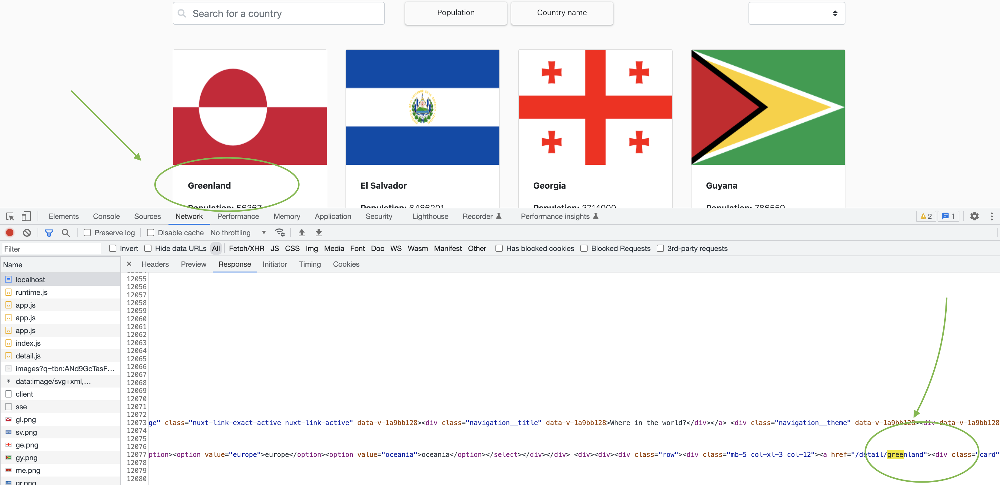
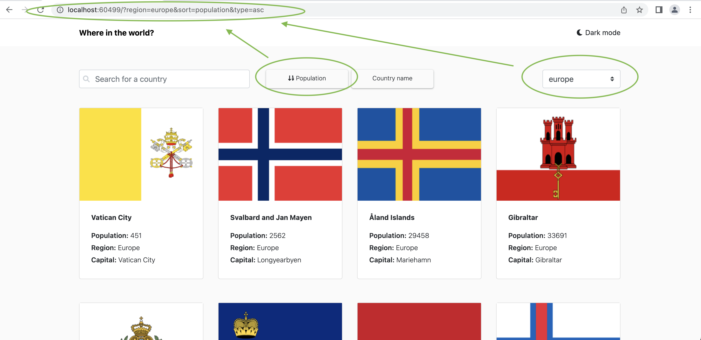
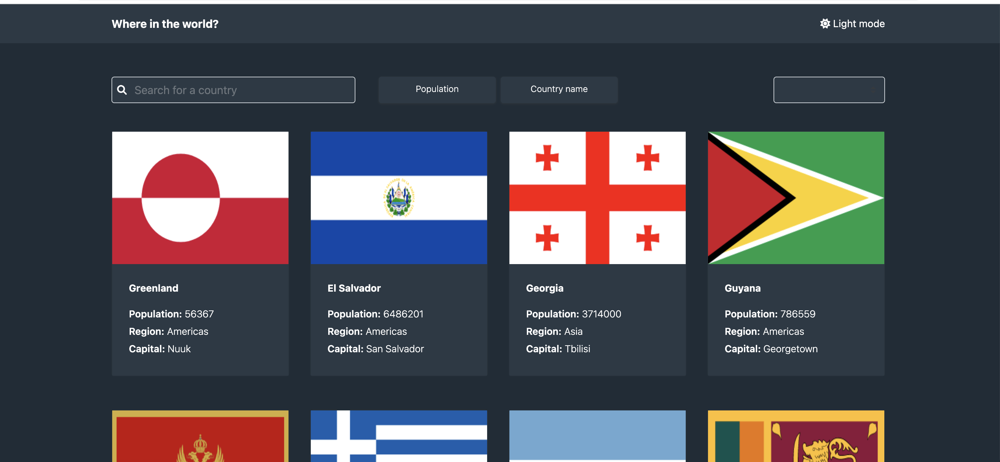
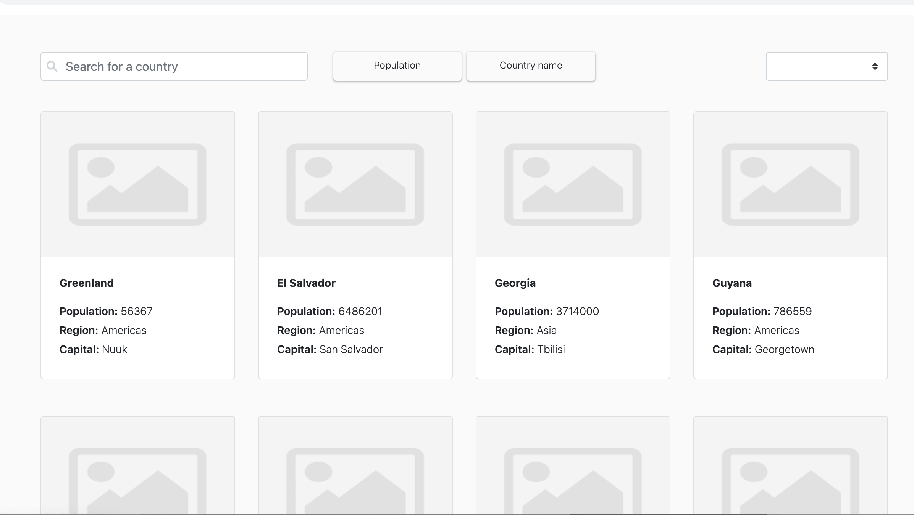

- [Featuers](#featuers)
  - [SSR Rendering with Nuxt](#ssr-rendering-with-nuxt)
  - [Sort](#sort)
  - [Push Search and Region and Sort to URL](#push-search-text-to-url)
- [Docker Test](#docker-test)
  - [Build Docker File](#build-docker)
  - [Run on docker](#start-docker)
- [normal Test](#normal-test)

# Important Note
- if you living in **Iran** please use vpn to can acess to Api Server
# Featuers
## SSR Rendering with Nuxt
all page compile on server and we use nuxt-links for client and server side support of pages
- for example if you inspect on browser and refresh page you see that page completely rendered from server but if you search a country name thsi operation process on client
here is screenshot of server side rendering


## Sort 
if you click on `population` or `country name` page sort with selected button `Asc`/`Desc`


## Push search text to url 
if we sort or search we change url and also this url processed on SSR if Google or any crawller wnat to see that URL



## Theme
 Toggle the color scheme between light and dark mode without using any 3rd party libraries



## Lazy load images
Using lazy loading for country images and list



## Server side rendering
Using server side rendering for list and detail pages


## Build Setup

```bash
# install dependencies
$ npm install

# serve with hot reload at localhost:3000
$ npm run dev

# build for production and launch server
$ npm run build
$ npm run start

# generate static project
$ npm run generate
```

For detailed explanation on how things work, check out the [documentation](https://nuxtjs.org).

## Special Directories

You can create the following extra directories, some of which have special behaviors. Only `pages` is required; you can delete them if you don't want to use their functionality.

### `assets`

The assets directory contains your uncompiled assets such as Stylus or Sass files, images, or fonts.

More information about the usage of this directory in [the documentation](https://nuxtjs.org/docs/2.x/directory-structure/assets).

### `components`

The components directory contains your Vue.js components. Components make up the different parts of your page and can be reused and imported into your pages, layouts and even other components.

More information about the usage of this directory in [the documentation](https://nuxtjs.org/docs/2.x/directory-structure/components).

### `layouts`

Layouts are a great help when you want to change the look and feel of your Nuxt app, whether you want to include a sidebar or have distinct layouts for mobile and desktop.

More information about the usage of this directory in [the documentation](https://nuxtjs.org/docs/2.x/directory-structure/layouts).


### `pages`

This directory contains your application views and routes. Nuxt will read all the `*.vue` files inside this directory and setup Vue Router automatically.

More information about the usage of this directory in [the documentation](https://nuxtjs.org/docs/2.x/get-started/routing).

### `plugins`

The plugins directory contains JavaScript plugins that you want to run before instantiating the root Vue.js Application. This is the place to add Vue plugins and to inject functions or constants. Every time you need to use `Vue.use()`, you should create a file in `plugins/` and add its path to plugins in `nuxt.config.js`.

More information about the usage of this directory in [the documentation](https://nuxtjs.org/docs/2.x/directory-structure/plugins).

### `static`

This directory contains your static files. Each file inside this directory is mapped to `/`.

Example: `/static/robots.txt` is mapped as `/robots.txt`.

More information about the usage of this directory in [the documentation](https://nuxtjs.org/docs/2.x/directory-structure/static).

### `store`

This directory contains your Vuex store files. Creating a file in this directory automatically activates Vuex.

More information about the usage of this directory in [the documentation](https://nuxtjs.org/docs/2.x/directory-structure/store).


# Docker test
## Build Docker 
to build docker use the following command in your bash or terminal
```bash
docker build -t front . 
```
## start docker
```bash
docker run -dp 3000:3000 front
```
